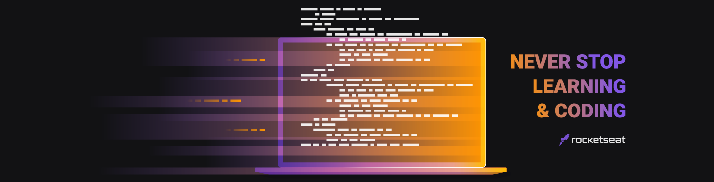

<a href="https://dev-finances-nu.vercel.app/"><p align="center"></p></a>

<p align="center"><a href="#sobre">About</a> | <a href="#tecnologias">Technologies</a> | <a href="#funcionalidades">Features</a> | <a href="#uso">Use of the application</a></p>



<h2>📌 About</h2>
<h3 id="sobre">🚀 dev.finance$ is a web-based finance control application designed by <a href="https://app.rocketseat.com.br/">Rocketseat</a> and developed by <a href="https://github.com/maykbrito">Mayk Brito</a>.</h3>

<p align="center">
  <a href="https://app.rocketseat.com.br/"></a>
  <a href="http://starter-bot.rocketseat.dev/api/discord/login?param=RGlzY292ZXI="></a></p>
  <p align="center"><a href="https://dev-finances-nu.vercel.app/"></a></p>
</p>

<strong><h3><p align="center">#NeverStopLearning 🚀</p></h3></strong>

<h4 align="center">🚧 Project finished.</h4>

<h2>🛠 Technologies</h2>
<strong><div id="tecnologias">The following tools were used in the construction of the project:</div></strong>
<p></p>
<li> <a href="https://developer.mozilla.org/pt-BR/docs/Web/HTML">HTML</a>
<li> <a href="https://www.w3schools.com/css/">CSS</a>
<li> <a href="https://developer.mozilla.org/pt-BR/docs/Web/Javascript">JavaScript</a>
<li> <a href="https://developers.google.com/chart">Google Charts</a>

<h2>🔧 Features</h2>
<strong id="funcionalidades">The following features have been added to the project:</strong>
<p></p>
<li> Dark mode.
<li> Possibility to order transactions as alphabetical, value and data.
<li> Button to remove all transactions.
<li> Possibility to filter only according to entries or options.
<li> Graphs showing the total percentage of entries and exits.
<li> Button to hide the balance.
<li> Loading screen.

<h2 id="uso">🗂 How to download the project</h2>

```
# Clone the repository
$ git clone https://github.com/JhonCavichioli/dev-finances.git

# Enter the project folder
$ cd dev-finances
```

<h2>📝 License</h2>
This project is under the <a href="./LICENSE">MIT license</a>. See the LICENSE file for more details.
